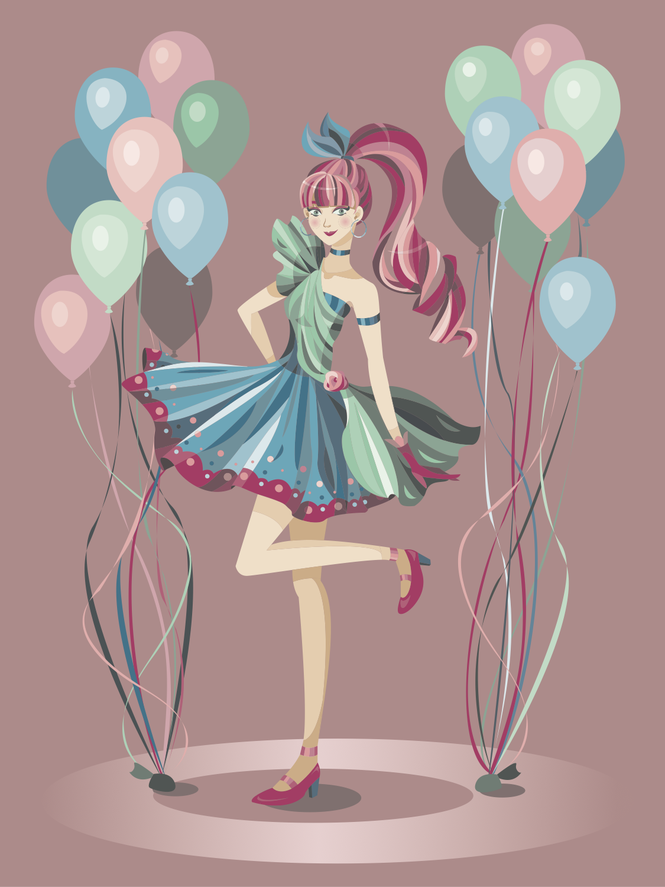
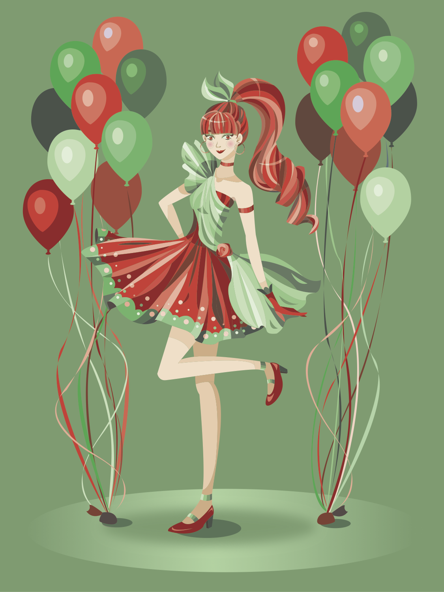
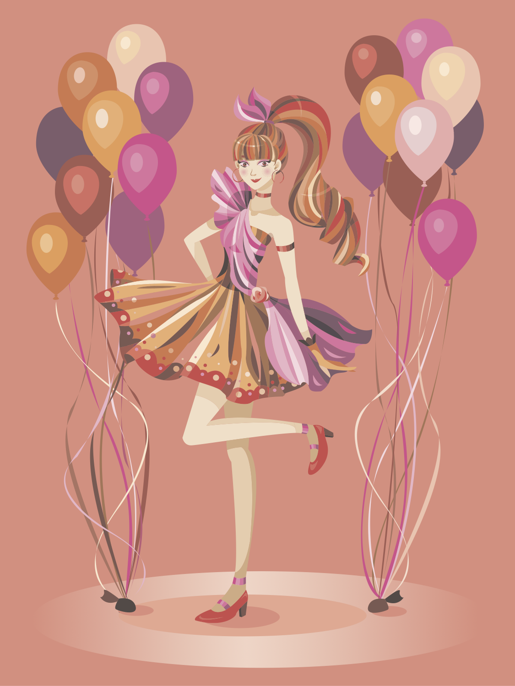
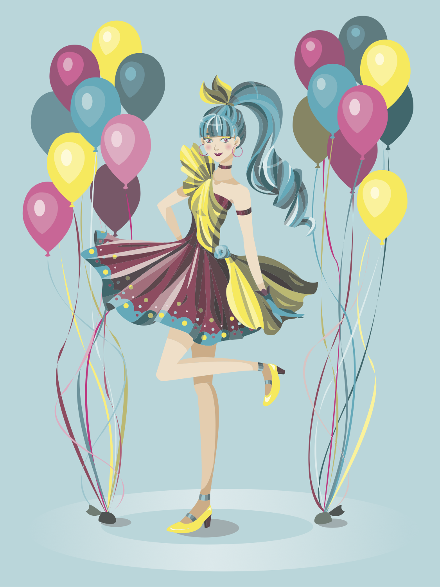

+++
    #this is the "front matter" of the template of a project. It's the variables associated with the file
    #this portion is written in TOML (Tom's Obvious Minimal Language)
    
    title = "A Dance With Color"
    #replace takes the filename and replaces all hyphens with spaces so that when it appears on your page, it's using spaces. The filename is used in the URL and URLs can't have spaces so use hyphen in the filename.
    #title converts to title-case (using capital letters for principal words only)
    
    date = 2019-05-30T10:00:11-07:00 #the date the file was created

    
    shortDescription = "I have always enjoyed drawing people and creating unique pieces of clothing for them. For this project, I designed the figure with a party theme in mind, hence the flouncy cocktail dress, the long flowing hair, and the energetic balloons in the background."
    projectVideo = ""
    #Project video is just the unique part of the URL  
    # For example, if the link is https://vimeo.com/285189099 then the unique part is  285189099
    projectVideoType = ""
    #Enter "youtube" or "vimeo". You can add other video types as well by editing single.html 
    projectImage = "compound.png"
    #Enter the filename only. For example, "metropolis_album.jpg" 
    #This image should be saved in the project folder with the name of your project 
    showImageOnProjectPage = false
    projectImageAltText = ""
    #Alt text is the text that gets read by screenreaders for accessibility (typically for the visually impaired) 

+++
<section class="overview">
    <h2 class="sectionTitle">Overview</h2>
    
Tools: Adobe Illustrator

    
Role: Art Director, Designer

    
Deliverables: Graphic poster designs

</section>

<h2 class="sectionTitle">Project Summary</h2>
I have always enjoyed drawing people and creating unique pieces of clothing for them. For this project, I designed the figure with a party theme in mind, hence the flouncy cocktail dress, the long flowing hair, and the energetic balloons in the background.

The four color schemes that this project studies are complementary, triadic, analogous, and compound, each color scheme aiming to bring out a different aspect of the design. Given the flat looking nature of digital design, I created the effect of shading and shadow by utilizing darker and lighter shades and tints of each color palette to give the designs more depth. Additionally, I experimented with the use of a gradient and some circular shadows on the floor to create a spotlight to ground the figure. Overall, this was a project that I greatly enjoyed creating and I approached it with a playfulness that was reminiscent of the childhood joy that I experienced from playing dress up with dolls as a young girl.

<body class="color">
    

        
        
        
        
    

</body>

<!-- a new line in markdown will not be displayed in the browser. 
\
\
\ 
the lines above this line showed up because they started with backslash (NOT A NORMAL SLASH) \
  
*here's some "emphasized" text, which defaults to italics but you can make it anythign you want in css*
**here's some "strong" text, which defaults to bold but you can make it anything you want in css**

Below is a list
* asterisks make bullets
- hyphens make bullets
+ plusses make bullets
* you can choose!
-->
