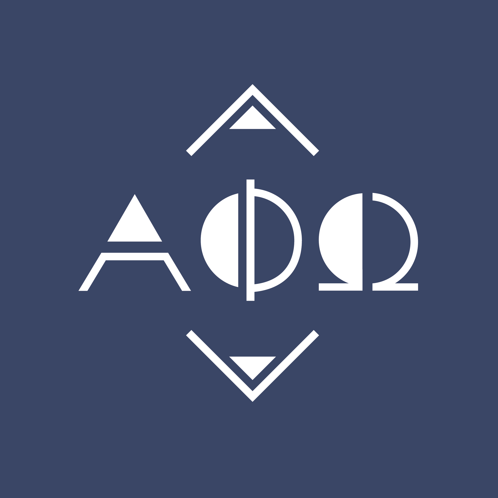
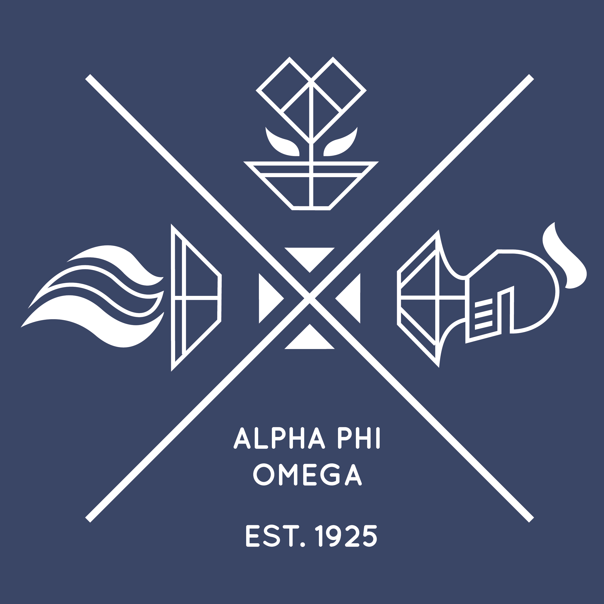

+++
    #this is the "front matter" of the template of a project. It's the variables associated with the file
    #this portion is written in TOML (Tom's Obvious Minimal Language)
    
    title = "Alpha Phi Omega Rush Shirt"
    #replace takes the filename and replaces all hyphens with spaces so that when it appears on your page, it's using spaces. The filename is used in the URL and URLs can't have spaces so use hyphen in the filename.
    #title converts to title-case (using capital letters for principal words only)
    
    date = 2019-06-05T23:58:59-07:00 #the date the file was created

    
    shortDescription = "Subtlety was the main goal behind this shirt design. After two years of being a part of Alpha Phi Omega, it was noticeable that some active members prefer less flashy designs. Thus, I created a design that represented Alpha Phi Omega’s values and principles while also catering to those that prefer a shirt design that they could casually wear around."
    projectVideo = ""
    #Project video is just the unique part of the URL  
    # For example, if the link is https://vimeo.com/285189099 then the unique part is  285189099
    projectVideoType = ""
    #Enter "youtube" or "vimeo". You can add other video types as well by editing single.html 
    projectImage = "apos2k191.png"
    #Enter the filename only. For example, "metropolis_album.jpg" 
    #This image should be saved in the project folder with the name of your project 
    showImageOnProjectPage = false
    projectImageAltText = ""
    #Alt text is the text that gets read by screenreaders for accessibility (typically for the visually impaired) 

+++

<section class="overview">
    <h2 class="sectionTitle">Overview</h2>
    
Tools: Adobe Illustrator

    
Role: Art Director, Designer

    
Deliverables: Rush shirt designs (front and back)

</section>

<h2 class="sectionTitle">Project Summary</h2>

Subtlety was the main goal behind this shirt design. After two years of being a part of Alpha Phi Omega, it was noticeable that some active members prefer less flashy designs. Thus, I created a design that represented Alpha Phi Omega’s values and principles while also catering to those that prefer a shirt design that they could casually wear around. The concept behind the design of the greek letters, “ΑΦΩ,” was geometric shapes; circles and triangles were the templates to forming the letters. 

As for the design on the back, the “X” shaped lines were used to tie the three symbols—the torch on the left being a symbol of leadership as well as a reference the torch of Alpha Phi Omega, the flowering heart in the center that represents friendship, and the knight’s helmet on the right as a metaphor for service—that reference Alpha Phi Omega’s three cardinal principles (Leadership, Friendship, and Service) and the text spelling the name of the fraternity and the year it was established together.

<body class="apo">
    

        
        
    

</body>

<!-- 

a new line in markdown will not be displayed in the browser.
\
\
\ 
the lines above this line showed up because they started with backslash (NOT A NORMAL SLASH) \
  
*here's some "emphasized" text, which defaults to italics but you can make it anythign you want in css*
**here's some "strong" text, which defaults to bold but you can make it anything you want in css**

Below is a list
* asterisks make bullets
- hyphens make bullets
+ plusses make bullets
* you can choose!
-->