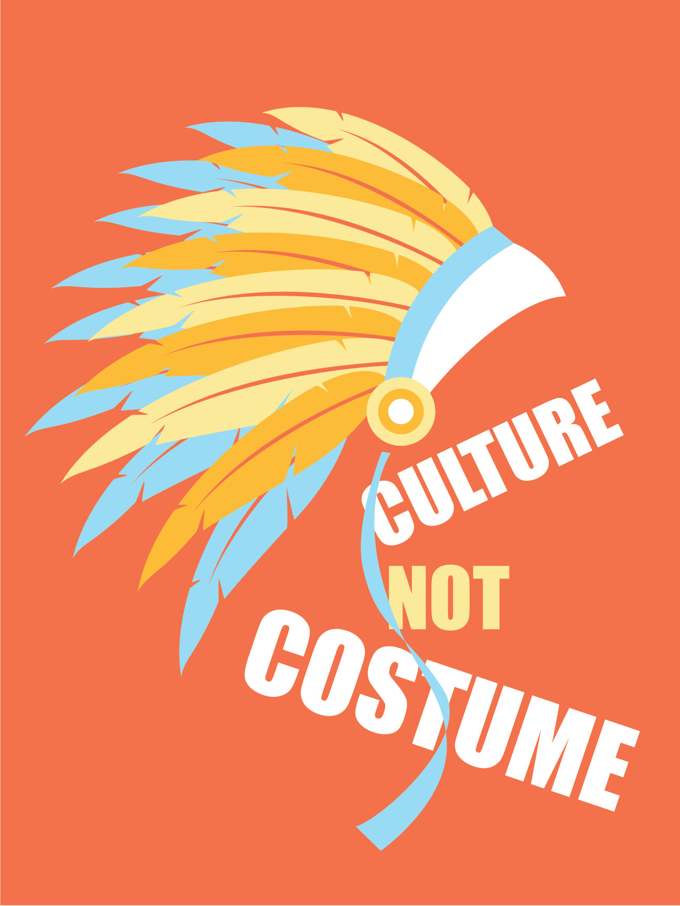
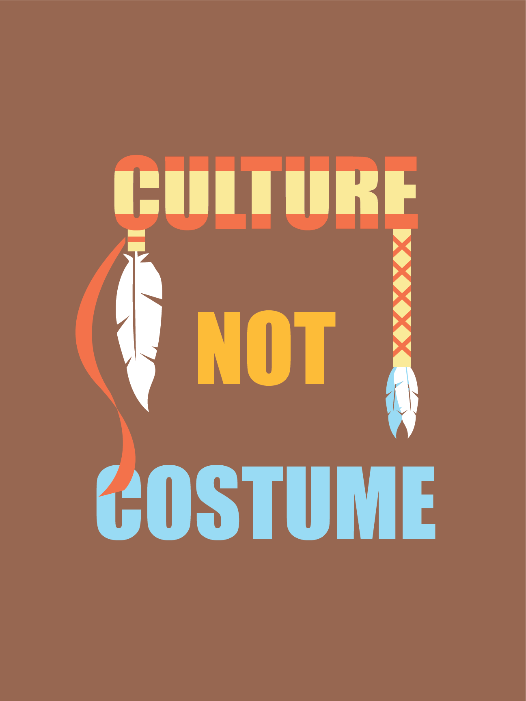

+++

    #this is the "front matter" of the template of a project. It's the variables associated with the file
    #this portion is written in TOML (Tom's Obvious Minimal Language)
    
    title = "Culture Not Costume"
    #replace takes the filename and replaces all hyphens with spaces so that when it appears on your page, it's using spaces. The filename is used in the URL and URLs can't have spaces so use hyphen in the filename.
    #title converts to title-case (using capital letters for principal words only)
    
    date = 2019-05-21T10:46:35-07:00 #the date the file was created

    
    shortDescription = "Posters on cultural appropriation"
    projectVideo = ""
    #Project video is just the unique part of the URL  
    # For example, if the link is https://vimeo.com/285189099 then the unique part is  285189099
    projectVideoType = ""
    #Enter "youtube" or "vimeo". You can add other video types as well by editing single.html 
    projectImage = "culture.png"
    #Enter the filename only. For example, "metropolis_album.jpg" 
    #This image should be saved in the project folder with the name of your project 
    projectImageAltText = ""
    #Alt text is the text that gets read by screenreaders for accessibility (typically for the visually impaired) 

+++

As an individual of color that presides in the United States of America, it is difficult not to be aware of the very prevalent issues of cultural appropriation in today’s society, especially in fashion and pop culture. This project, Culture Not Costume, is based upon identifying the appropriation of traditional Native American headdresses, an act that has persisted and continues to persist in the fashion industry.

The slogan “Culture Not Costume” was chosen because it is short, easy to remember, and easy to understand. Paired with a legible bold typeface, casual browsers are able to quickly grasp the concept behind these posters.

<body class="cultureBackground">
    

    

</body>

<!--a new line in markdown will not be displayed in the browser.
\
\
\ 
the lines above this line showed up because they started with backslash (NOT A NORMAL SLASH) \
  
*here's some "emphasized" text, which defaults to italics but you can make it anythign you want in css*
**here's some "strong" text, which defaults to bold but you can make it anything you want in css**

Below is a list
* asterisks make bullets
- hyphens make bullets
+ plusses make bullets
* you can choose! -->
