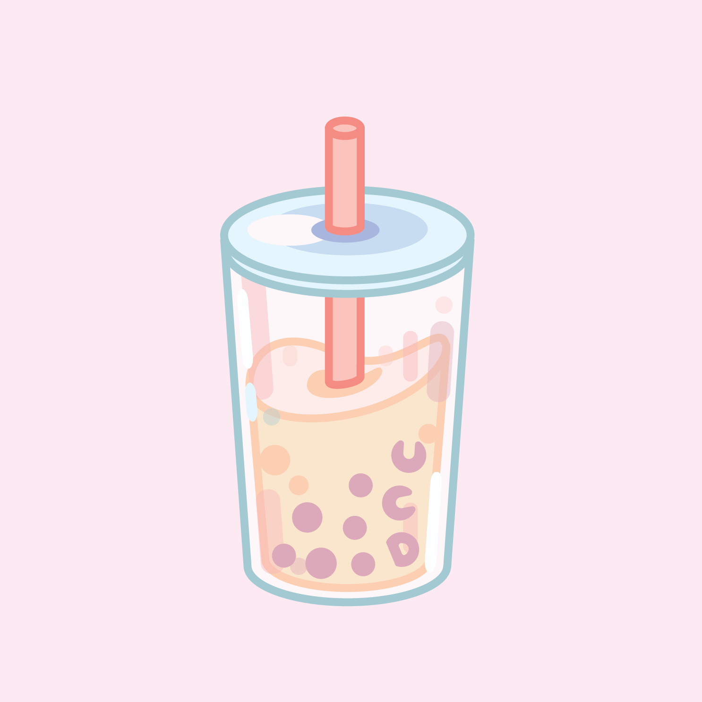
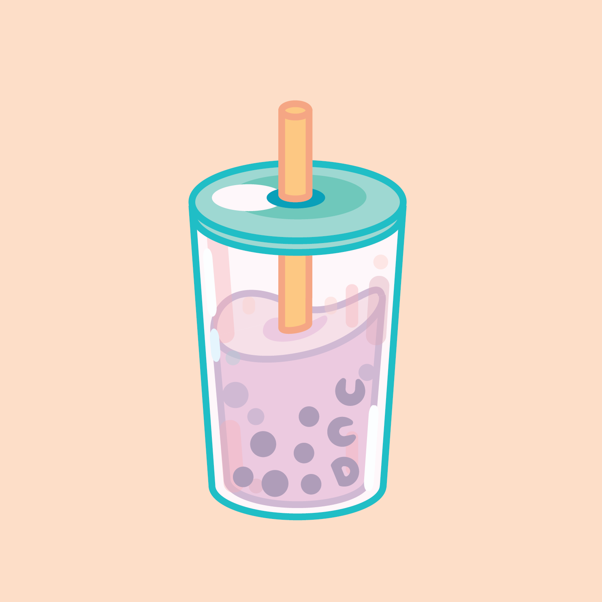
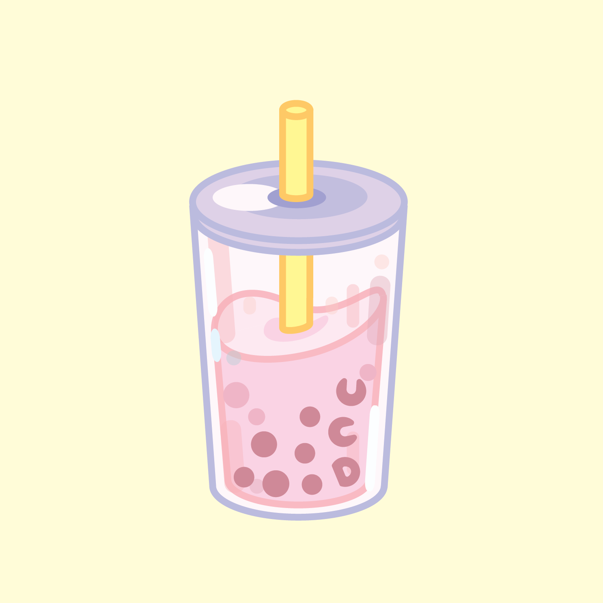
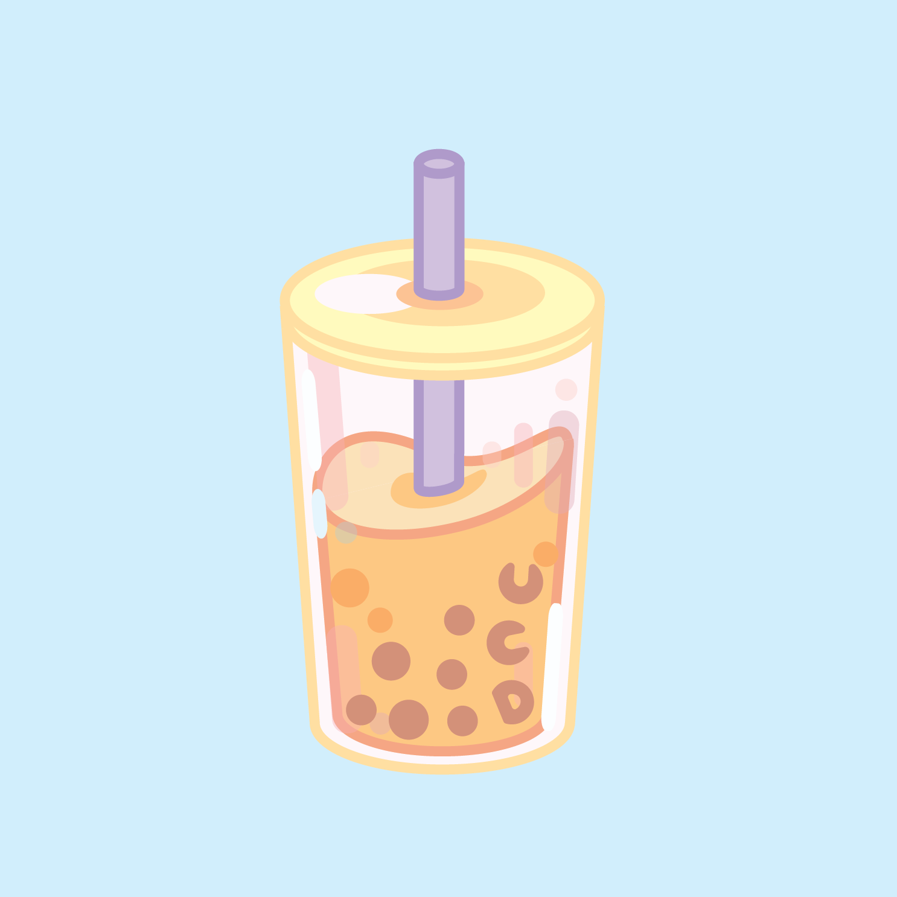
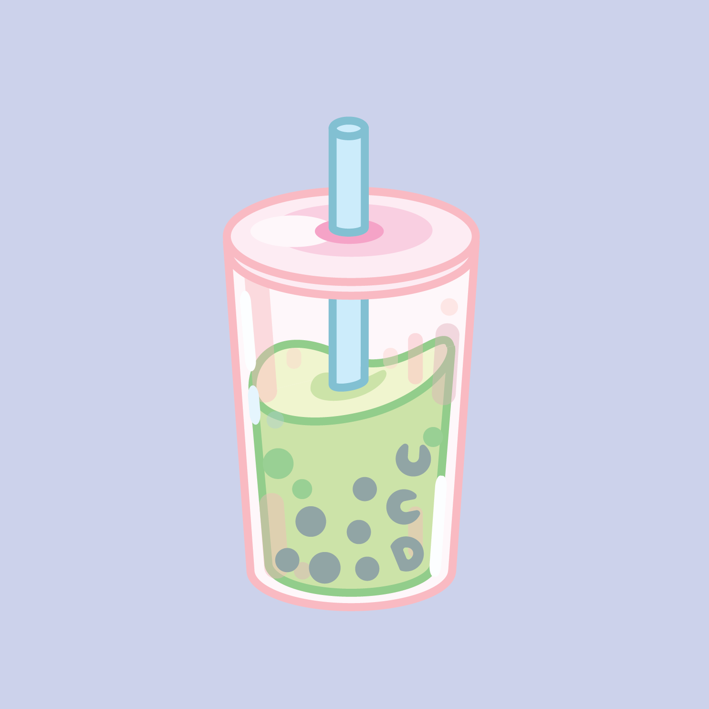

+++
    #this is the "front matter" of the template of a project. It's the variables associated with the file
    #this portion is written in TOML (Tom's Obvious Minimal Language)
    
    title = "Rainboba"
    #replace takes the filename and replaces all hyphens with spaces so that when it appears on your page, it's using spaces. The filename is used in the URL and URLs can't have spaces so use hyphen in the filename.
    #title converts to title-case (using capital letters for principal words only)
    
    date = 2019-06-06T01:20:25-07:00 #the date the file was created

    
    shortDescription = "The original purpose of this project was to create stickers for my university organization, Alpha Phi Omega, in order to fundraise for our chapter. I chose boba tea as the subject of this design as it is a very trendy and popular drink among college students."
    projectVideo = ""
    #Project video is just the unique part of the URL  
    # For example, if the link is https://vimeo.com/285189099 then the unique part is  285189099
    projectVideoType = ""
    #Enter "youtube" or "vimeo". You can add other video types as well by editing single.html 
    projectImage = "tea1.png"
    #Enter the filename only. For example, "metropolis_album.jpg" 
    #This image should be saved in the project folder with the name of your project 
    showImageOnProjectPage = false
    projectImageAltText = ""
    #Alt text is the text that gets read by screenreaders for accessibility (typically for the visually impaired) 

+++
<section class="overview">
    <h2 class="sectionTitle">Overview</h2>
    
Tools: Adobe Illustrator

    
Role: Art Director, Designer

    
Deliverables: Rush shirt designs (front and back)

</section>

<h2 class="sectionTitle">Project Summary</h2>
The original purpose of this project was to create stickers for my university organization, Alpha Phi Omega, in order to fundraise for our chapter. I chose boba tea as the subject of this design as it is a very trendy and popular drink among college students.

The color palettes I chose are pastel and easy on the eyes, each color scheme representing a different flavor of tea drink: the classic milk tea, taro milk tea, strawberry milk tea, thai tea, and matcha milk tea. Overall, the design is playful and fun, with three boba pearls subtly spelling “UCD,” short for University of California, Davis (my own school).

<body class="boba">
    

        
        
        
        
        
    

</body>

<!--
a new line in markdown will not be displayed in the browser.
\
\
\ 
the lines above this line showed up because they started with backslash (NOT A NORMAL SLASH) \
  
*here's some "emphasized" text, which defaults to italics but you can make it anythign you want in css*
**here's some "strong" text, which defaults to bold but you can make it anything you want in css**

Below is a list
* asterisks make bullets
- hyphens make bullets
+ plusses make bullets
* you can choose!
-->